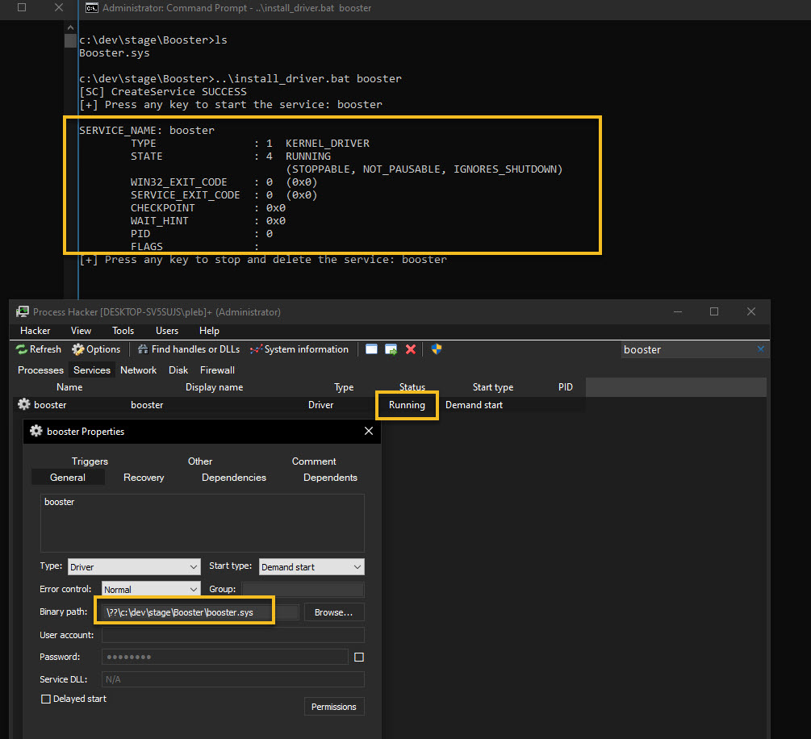

# Debugging kernel driver and understanding i/o routing with various structures


Let's debug a very simple driver from pavel's latest book on kernel programming
and understand different structures along with their relationship and overall
flow of operations.

For more detailed insights refer to the book for better explanation. Here we
will be understanding with the help of windbg and try to relate in depth.

[pavel's book](https://leanpub.com/windowskernelprogrammingsecondedition)


[booster sample](https://github.com/zodiacon/windowskernelprogrammingbook2e/tree/master/Chapter05)


Driver install and launch

___

I have built the driver for 32-bit windows 10.



<br>


Break into debugger just when the driver image is loaded in memory when we
issue `sc start booster` or load driver programatically

___


```
# This allows debugger to be broken when driver image is being loaded in memory
0: kd> sxe ld booster.sys

0: kd> g
nt!DbgLoadImageSymbols+0x41:
82147053 int     3

0: kd> kvn
 # ChildEBP RetAddr  Args to Child
00 9261796c 82146ff6 92617984 92617958 ffffffff nt!DbgLoadImageSymbols+0x41 (FPO: [Non-Fpo])
01 9261798c 82433da4 00000016 a2b5c428 00000000 nt!DbgLoadImageSymbolsUnicode+0x2c (FPO: [Non-Fpo])
02 926179c8 8243437c 92617b60 92617a30 92617a18 nt!MiDriverLoadSucceeded+0x144 (FPO: [Non-Fpo])
03 92617aa8 82433e2d 00000000 00000000 92617b34 nt!MmLoadSystemImageEx+0x544 (FPO: [4,47,4])
04 92617ac0 82434e99 92617b60 00000000 00000000 nt!MmLoadSystemImage+0x25 (FPO: [Non-Fpo])
05 92617bc0 82431fe7 00000000 92617be4 8a551978 nt!IopLoadDriver+0x20b (FPO: [Non-Fpo])
06 92617be8 820eb098 9e16bba8 00000000 8de4b900 nt!IopLoadUnloadDriver+0x4d (FPO: [1,3,4])
07 92617c38 82101200 8a551978 d937df7d 00000000 nt!ExpWorkerThread+0xf8 (FPO: [Non-Fpo])
08 92617c70 8219a73d 820eafa0 8a551978 00000000 nt!PspSystemThreadStartup+0x4a (FPO: [Non-Fpo])
09 92617c7c 00000000 00000000 00000000 00000000 nt!KiThreadStartup+0x15

# Running in system context
0: kd> !process -1 0
PROCESS 8a55f7c0  SessionId: none  Cid: 0004    Peb: 00000000  ParentCid: 0000
    DirBase: 001a8000  ObjectTable: 8b202cc0  HandleCount: 1683.
    Image: System

0: kd> ub 82146ff6
nt!DbgLoadImageSymbolsUnicode+0x17:
82146fe1 call    nt!DbgUnicodeStringToAnsiString (82147058)
82146fe6 test    eax,eax
82146fe8 je      nt!DbgLoadImageSymbolsUnicode+0x3e (82147008)
82146fea push    0FFFFFFFFh
82146fec push    esi
82146fed lea     eax,[ebp-8]
82146ff0 push    eax
82146ff1 call    nt!DbgLoadImageSymbols (82147012)

0: kd> r
eax=00000003 ebx=a2b5c428 ecx=92617984 edx=92617958 esi=a43c0000 edi=92617a30
eip=82147053 esp=92617958 ebp=9261796c iopl=0         nv up ei ng nz na pe nc
cs=0008  ss=0010  ds=0023  es=0023  fs=0030  gs=0000             efl=00000286
nt!DbgLoadImageSymbols+0x41:
82147053 int     3

0: kd> dc 92617984
92617984  000c000b ae9f73c0 926179c8 82433da4  .....s...ya..=C.
92617994  00000016 a2b5c428 00000000 a43c0000  ....(.........<.
926179a4  0000001c 00014503 a43c0000 00000000  .....E....<.....
926179b4  00007000 00000000 a2b028c8 00180016  .p.......(......
926179c4  b6abbe28 92617aa8 8243437c 92617b60  (....za.|CC.`{a.
926179d4  92617a30 92617a18 8aa00201 8000195c  0za..za.....\...
926179e4  00000000 00000000 00000fff 00000000  ................
926179f4  00000001 00000000 ae8cda58 0000001f  ........X.......

# Dumping image name
0: kd> ds 92617984
ae9f73c0  "booster.sys"

0: kd> db 92617958
92617958  00 00 3c a4 ff ff ff ff-55 b2 00 00 00 70 00 00  ..<.....U....p..
92617968  84 79 61 92 8c 79 61 92-f6 6f 14 82 84 79 61 92  .ya..ya..o...ya.
92617978  58 79 61 92 ff ff ff ff-28 be ab b6 0b 00 0c 00  Xya.....(.......
92617988  c0 73 9f ae c8 79 61 92-a4 3d 43 82 16 00 00 00  .s...ya..=C.....
92617998  28 c4 b5 a2 00 00 00 00-00 00 3c a4 1c 00 00 00  (.........<.....
926179a8  03 45 01 00 00 00 3c a4-00 00 00 00 00 70 00 00  .E....<......p..
926179b8  00 00 00 00 c8 28 b0 a2-16 00 18 00 28 be ab b6  .....(......(...
926179c8  a8 7a 61 92 7c 43 43 82-60 7b 61 92 30 7a 61 92  .za.|CC.`{a.0za.

# Image handle
0: kd> dd 92617958 l1
92617958  a43c0000

0: kd> !dh a43c0000

File Type: EXECUTABLE IMAGE
FILE HEADER VALUES
     14C machine (i386)
       6 number of sections
61777EC7 time date stamp Tue Oct 26 09:36:31 2021

       0 file pointer to symbol table
       0 number of symbols
      E0 size of optional header
     102 characteristics
            Executable
            32 bit word machine

OPTIONAL HEADER VALUES
     10B magic #
   14.29 linker version
    1400 size of code
     A00 size of initialized data
       0 size of uninitialized data
    5000 address of entry point
    1000 base of code
         ----- new -----
a43c0000 image base
    1000 section alignment
     200 file alignment
       1 subsystem (Native)
   10.00 operating system version
   10.00 image version
   10.00 subsystem version
    7000 size of image
     400 size of headers
    B255 checksum
00100000 size of stack reserve
00001000 size of stack commit
00100000 size of heap reserve
00001000 size of heap commit
    4540  DLL characteristics
            Dynamic base
            NX compatible
            No structured exception handler
            Guard
       0 [       0] address [size] of Export Directory
    5030 [      3C] address [size] of Import Directory
       0 [       0] address [size] of Resource Directory
       0 [       0] address [size] of Exception Directory
    2200 [     700] address [size] of Security Directory
    6000 [      CC] address [size] of Base Relocation Directory
    2064 [      38] address [size] of Debug Directory
       0 [       0] address [size] of Description Directory
       0 [       0] address [size] of Special Directory
       0 [       0] address [size] of Thread Storage Directory
    20A0 [      AC] address [size] of Load Configuration Directory
       0 [       0] address [size] of Bound Import Directory
    2000 [      40] address [size] of Import Address Table Directory
       0 [       0] address [size] of Delay Import Directory
       0 [       0] address [size] of COR20 Header Directory
       0 [       0] address [size] of Reserved Directory


SECTION HEADER #1
   .text name
     CDE virtual size
    1000 virtual address
     E00 size of raw data
     400 file pointer to raw data
       0 file pointer to relocation table
       0 file pointer to line numbers
       0 number of relocations
       0 number of line numbers
68000020 flags
         Code
         Not Paged
         (no align specified)
         Execute Read

SECTION HEADER #2
  .rdata name
     470 virtual size
    2000 virtual address
     600 size of raw data
    1200 file pointer to raw data
       0 file pointer to relocation table
       0 file pointer to line numbers
       0 number of relocations
       0 number of line numbers
48000040 flags
         Initialized Data
         Not Paged
         (no align specified)
         Read Only


Debug Directories(2)
	Type       Size     Address  Pointer
	cv           57        228c     148c	Format: RSDS, guid, 1, J:\dev\temp\driver\kerprg2\Chapter05\Booster\debug\Booster.pdb
	(    13)     18c        22e4     14e4

(truncated)

# Same stuff via nt!MmLoadSystemImage present in the callstack
0: kd> dt nt!_UNICODE_STRING 92617b60
 "\??\c:\dev\stage\Booster\booster.sys"
   +0x000 Length           : 0x48
   +0x002 MaximumLength    : 0x4a
   +0x004 Buffer           : 0xa7db6b40  "\??\c:\dev\stage\Booster\booster.sys"

```

<br>


**Driver Entry**

___


Once driver image has been loaded in memory, DriverEntry is invoked where
driver's initialization and setup is performed.

>* Driver Load and Unload Routines are invoked by I/O Manager or service control
>  manager (SCM) during driver's loading into memory and when driver is removed
>  from memory
>* I/O Dispatch Routines are invoked by an application or driver to dispatch a
>  Create, Read, Write, IOCTL, Close and Cleanup IRP to the driver


booster's driver entry performs following

>* Create a device object
>* Create symbolic link so that device object is accessible from usermode.
>* Setup handler functions in the driver's dispatch routine

[*DRIVER_OBJECT*](https://docs.microsoft.com/en-us/windows-hardware/drivers/ddi/wdm/ns-wdm-_driver_object)

[*DEVICE_OBJECT*](https://docs.microsoft.com/en-us/windows-hardware/drivers/ddi/wdm/ns-wdm-_device_object)

[*DRIVER_DISPATCH*](https://docs.microsoft.com/en-us/windows-hardware/drivers/ddi/wdm/nc-wdm-driver_dispatch)


DRIVER_OBJECT's state post DriverEntry after all the initilization and setting
up of supported handler function.

___


Winobj to view symlink that points to `\device\booster`

___


Time to dive in with debugger

___


```
# Breakpoints
1: kd> bl
     0 e Disable Clear u             0001 (0001) (booster!driverentry)
     1 e Disable Clear u             0001 (0001) (@@masm(`booster!J:\dev\temp\driver\kerprg2\Chapter05\Booster\Booster.cpp:64+`))
     2 e Disable Clear u             0001 (0001) (@@masm(`booster!J:\dev\temp\driver\kerprg2\Chapter05\Booster\Booster.cpp:78+`))
     3 e Disable Clear u             0001 (0001) (@@masm(`booster!J:\dev\temp\driver\kerprg2\Chapter05\Booster\Booster.cpp:91+`))

1: kd> g
Breakpoint 0 hit
booster!DriverEntry:
939d1990 push    ebp

# Driver entry gets hit
1: kd> kc
00 booster!DriverEntry
01 nt!PnpCallDriverEntry
02 nt!IopLoadDriver
03 nt!IopLoadUnloadDriver
04 nt!ExpWorkerThread
05 nt!PspSystemThreadStartup
06 nt!KiThreadStartup

1: kd> !process -1 0
PROCESS 85d5f7c0  SessionId: none  Cid: 0004    Peb: 00000000  ParentCid: 0000
    DirBase: 001a8000  ObjectTable: 89c02cc0  HandleCount: 2222.
    Image: System

1: kd> p
booster!DriverEntry+0x1c1:
939d1b51 cmp     dword ptr [ebp-4],0

1: kd> p
booster!DriverEntry+0x1d9:
939d1b69 xor     eax,eax

1: kd> dv /v /t
ae1ffab8          struct _DRIVER_OBJECT * DriverObject = 0xa0291430 Driver "\Driver\booster"
ae1ffabc          struct _UNICODE_STRING * RegistryPath = 0xc3525000 "\REGISTRY\MACHINE\SYSTEM\ControlSet001\Services\booster"
ae1ffa80          struct _UNICODE_STRING devName = "\Device\Booster"
ae1ffa78          struct _UNICODE_STRING symLink = "\??\Booster"
ae1ffaa0          struct _DEVICE_OBJECT * DeviceObject = 0xb41bc7a0 Device for "\Driver\booster"
ae1ffaac          long status = 0


1: kd> dt nt!_DRIVER_OBJECT 0xa0291430
   +0x000 Type             : 0n4
   +0x002 Size             : 0n168
   +0x004 DeviceObject     : 0xb41bc7a0 _DEVICE_OBJECT
   +0x008 Flags            : 2
   +0x00c DriverStart      : 0x939d0000 Void
   +0x010 DriverSize       : 0x7000
   +0x014 DriverSection    : 0xcc1f5ce8 Void
   +0x018 DriverExtension  : 0xa02914d8 _DRIVER_EXTENSION
   +0x01c DriverName       : _UNICODE_STRING "\Driver\booster"
   +0x024 HardwareDatabase : 0x84e90378 _UNICODE_STRING "\REGISTRY\MACHINE\HARDWARE\DESCRIPTION\SYSTEM"
   +0x028 FastIoDispatch   : (null)
   +0x02c DriverInit       : 0x939d5000     long  booster!GsDriverEntry+0
   +0x030 DriverStartIo    : (null)
   +0x034 DriverUnload     : 0x939d17a0     void  booster!BoosterUnload+0
   +0x038 MajorFunction    : [28] 0x939d1700     long  booster!BoosterCreateClose+0


1: kd> !devobj 0xb41bc7a0
Device object (b41bc7a0) is for:
 Booster \Driver\booster DriverObject a0291430
Current Irp 00000000 RefCount 0 Type 00000022 Flags 000000c0
SecurityDescriptor 8f902590 DevExt 00000000 DevObjExt b41bc858
ExtensionFlags (0x00000800)  DOE_DEFAULT_SD_PRESENT
Characteristics (0000000000)
Device queue is not busy.


1: kd> dx -id 0,0,85d5f7c0 -r1 (*((ntkrpamp!long (*(*)[28])(_DEVICE_OBJECT *,_IRP *))0xa0291468))
(*((ntkrpamp!long (*(*)[28])(_DEVICE_OBJECT *,_IRP *))0xa0291468))                 [Type: long (* [28])(_DEVICE_OBJECT *,_IRP *)]
    [0]              : 0x939d1700 [Type: long (*)(_DEVICE_OBJECT *,_IRP *)]
    [1]              : 0x849290de [Type: long (*)(_DEVICE_OBJECT *,_IRP *)]
    [2]              : 0x939d1700 [Type: long (*)(_DEVICE_OBJECT *,_IRP *)]
    [3]              : 0x849290de [Type: long (*)(_DEVICE_OBJECT *,_IRP *)]
    [4]              : 0x939d1840 [Type: long (*)(_DEVICE_OBJECT *,_IRP *)]
    [5]              : 0x849290de [Type: long (*)(_DEVICE_OBJECT *,_IRP *)]
    [6]              : 0x849290de [Type: long (*)(_DEVICE_OBJECT *,_IRP *)]
    [7]              : 0x849290de [Type: long (*)(_DEVICE_OBJECT *,_IRP *)]
    [8]              : 0x849290de [Type: long (*)(_DEVICE_OBJECT *,_IRP *)]
    [9]              : 0x849290de [Type: long (*)(_DEVICE_OBJECT *,_IRP *)]
    [10]             : 0x849290de [Type: long (*)(_DEVICE_OBJECT *,_IRP *)]
    [11]             : 0x849290de [Type: long (*)(_DEVICE_OBJECT *,_IRP *)]
    [12]             : 0x849290de [Type: long (*)(_DEVICE_OBJECT *,_IRP *)]
    [13]             : 0x849290de [Type: long (*)(_DEVICE_OBJECT *,_IRP *)]
    [14]             : 0x849290de [Type: long (*)(_DEVICE_OBJECT *,_IRP *)]
    [15]             : 0x849290de [Type: long (*)(_DEVICE_OBJECT *,_IRP *)]
    [16]             : 0x849290de [Type: long (*)(_DEVICE_OBJECT *,_IRP *)]
    [17]             : 0x849290de [Type: long (*)(_DEVICE_OBJECT *,_IRP *)]
    [18]             : 0x849290de [Type: long (*)(_DEVICE_OBJECT *,_IRP *)]
    [19]             : 0x849290de [Type: long (*)(_DEVICE_OBJECT *,_IRP *)]
    [20]             : 0x849290de [Type: long (*)(_DEVICE_OBJECT *,_IRP *)]
    [21]             : 0x849290de [Type: long (*)(_DEVICE_OBJECT *,_IRP *)]
    [22]             : 0x849290de [Type: long (*)(_DEVICE_OBJECT *,_IRP *)]
    [23]             : 0x849290de [Type: long (*)(_DEVICE_OBJECT *,_IRP *)]
    [24]             : 0x849290de [Type: long (*)(_DEVICE_OBJECT *,_IRP *)]
    [25]             : 0x849290de [Type: long (*)(_DEVICE_OBJECT *,_IRP *)]
    [26]             : 0x849290de [Type: long (*)(_DEVICE_OBJECT *,_IRP *)]
    [27]             : 0x849290de [Type: long (*)(_DEVICE_OBJECT *,_IRP *)]

# Dispatch routines defined for driver, rest are defaults provided by i/o mgr
1: kd> ln 0x939d1700
Browse module
Set bu breakpoint

 [J:\dev\temp\driver\kerprg2\Chapter05\Booster\Booster.cpp @ 77] (939d1700)   booster!BoosterCreateClose   |  (939d17a0)   booster!BoosterUnload
Exact matches:
    booster!BoosterCreateClose (struct _DEVICE_OBJECT *, struct _IRP *)

1: kd> ln 0x939d1840
Browse module
Set bu breakpoint

 [J:\dev\temp\driver\kerprg2\Chapter05\Booster\Booster.cpp @ 90] (939d1840)   booster!BoosterWrite   |  (939d1990)   booster!DriverEntry
Exact matches:
    booster!BoosterWrite (struct _DEVICE_OBJECT *, struct _IRP *)


# Device Object that we created
1: kd> dt nt!_DEVICE_OBJECT 0xb41bc7a0
   +0x000 Type             : 0n3
   +0x002 Size             : 0xb8
   +0x004 ReferenceCount   : 0
   +0x008 DriverObject     : 0xa0291430 _DRIVER_OBJECT <--- Points back to DRIVER_OBJECT
   +0x00c NextDevice       : (null)
   +0x010 AttachedDevice   : (null)
   +0x014 CurrentIrp       : (null)
   +0x018 Timer            : (null)
   +0x01c Flags            : 0xc0
   +0x020 Characteristics  : 0
   +0x024 Vpb              : (null)
   +0x028 DeviceExtension  : (null)
   +0x02c DeviceType       : 0x22
   +0x030 StackSize        : 1 ''
   +0x034 Queue            : <anonymous-tag>
   +0x05c AlignmentRequirement : 0
   +0x060 DeviceQueue      : _KDEVICE_QUEUE
   +0x074 Dpc              : _KDPC
   +0x094 ActiveThreadCount : 0
   +0x098 SecurityDescriptor : 0x8f902590 Void
   +0x09c DeviceLock       : _KEVENT
   +0x0ac SectorSize       : 0
   +0x0ae Spare1           : 0
   +0x0b0 DeviceObjectExtension : 0xb41bc858 _DEVOBJ_EXTENSION
   +0x0b4 Reserved         : (null)

# Security descriptor associated with the device object.
1: kd> !sd 0x8f902590
->Revision: 0x1
->Sbz1    : 0x0
->Control : 0x8814
            SE_DACL_PRESENT
            SE_SACL_PRESENT
            SE_SACL_AUTO_INHERITED
            SE_SELF_RELATIVE
->Owner   : S-1-5-32-544
->Group   : S-1-5-18
->Dacl    :
->Dacl    : ->AclRevision: 0x2
->Dacl    : ->Sbz1       : 0x0
->Dacl    : ->AclSize    : 0x5c
->Dacl    : ->AceCount   : 0x4
->Dacl    : ->Sbz2       : 0x0
->Dacl    : ->Ace[0]: ->AceType: ACCESS_ALLOWED_ACE_TYPE
->Dacl    : ->Ace[0]: ->AceFlags: 0x0
->Dacl    : ->Ace[0]: ->AceSize: 0x14
->Dacl    : ->Ace[0]: ->Mask : 0x001201bf
->Dacl    : ->Ace[0]: ->SID: S-1-1-0

->Dacl    : ->Ace[1]: ->AceType: ACCESS_ALLOWED_ACE_TYPE
->Dacl    : ->Ace[1]: ->AceFlags: 0x0
->Dacl    : ->Ace[1]: ->AceSize: 0x14
->Dacl    : ->Ace[1]: ->Mask : 0x001f01ff
->Dacl    : ->Ace[1]: ->SID: S-1-5-18

->Dacl    : ->Ace[2]: ->AceType: ACCESS_ALLOWED_ACE_TYPE
->Dacl    : ->Ace[2]: ->AceFlags: 0x0
->Dacl    : ->Ace[2]: ->AceSize: 0x18
->Dacl    : ->Ace[2]: ->Mask : 0x001f01ff
->Dacl    : ->Ace[2]: ->SID: S-1-5-32-544

->Dacl    : ->Ace[3]: ->AceType: ACCESS_ALLOWED_ACE_TYPE
->Dacl    : ->Ace[3]: ->AceFlags: 0x0
->Dacl    : ->Ace[3]: ->AceSize: 0x14
->Dacl    : ->Ace[3]: ->Mask : 0x001200a9
->Dacl    : ->Ace[3]: ->SID: S-1-5-12

->Sacl    :
->Sacl    : ->AclRevision: 0x2
->Sacl    : ->Sbz1       : 0x0
->Sacl    : ->AclSize    : 0x1c
->Sacl    : ->AceCount   : 0x1
->Sacl    : ->Sbz2       : 0x0
->Sacl    : ->Ace[0]: ->AceType: SYSTEM_MANDATORY_LABEL_ACE_TYPE
->Sacl    : ->Ace[0]: ->AceFlags: 0x0
->Sacl    : ->Ace[0]: ->AceSize: 0x14
->Sacl    : ->Ace[0]: ->Mask : 0x00000001
->Sacl    : ->Ace[0]: ->SID: S-1-16-4096

# We haven't defined any device extension during IoCreateDevice(...)
1: kd> dx -id 0,0,85d5f7c0 -r1 ((ntkrpamp!_DEVOBJ_EXTENSION *)0xb41bc858)
((ntkrpamp!_DEVOBJ_EXTENSION *)0xb41bc858)                 : 0xb41bc858 [Type: _DEVOBJ_EXTENSION *]
    [+0x000] Type             : 13 [Type: short]
    [+0x002] Size             : 0x0 [Type: unsigned short]
    [+0x004] DeviceObject     : 0xb41bc7a0 : Device for "\Driver\booster" [Type: _DEVICE_OBJECT *]
    [+0x008] PowerFlags       : 0x0 [Type: unsigned long]
    [+0x00c] Dope             : 0x0 [Type: _DEVICE_OBJECT_POWER_EXTENSION *]
    [+0x010] ExtensionFlags   : 0x800 [Type: unsigned long]
    [+0x014] DeviceNode       : 0x0 [Type: void *]
    [+0x018] AttachedTo       : 0x0 [Type: _DEVICE_OBJECT *]
    [+0x01c] StartIoCount     : 0x0 [Type: long]
    [+0x020] StartIoKey       : 0x0 [Type: long]
    [+0x024] StartIoFlags     : 0x0 [Type: unsigned long]
    [+0x028] Vpb              : 0x0 [Type: _VPB *]
    [+0x02c] DependencyNode   : 0x0 [Type: void *]
    [+0x030] InterruptContext : 0x0 [Type: void *]
    [+0x034] InterruptCount   : 0x0 [Type: long]
    [+0x038] VerifierContext  : 0x0 [Type: void *]

```

<br>


IRP_MJ_CREATE is invoked next, when user tries to get handle to device via CreateFile

___


>
>When Sent The operating system sends an IRP_MJ_CREATE request to open a handle
>to a file object or device object. For example, when a driver calls
>ZwCreateFile, the operating system sends an IRP_MJ_CREATE request to perform
>the actual open operation.
>


IRP major function codes

___


>
>IRP_MJ_CREATE 0x00
>
>IRP_MJ_CLOSE 0x02
>
>IRP_MJ_READ 0x03
>
>IRP_MJ_WRITE 0x04
>
>(truncated)


Relationship between FILE_OBJECT, DEVICE_OBJECT and DRIVER_OBJECT

___


<br>


IRP_MJ_CREATE with windbg in more detail

___


```

0: kd> g
Breakpoint 2 hit
booster!BoosterCreateClose+0x6:
939d1706 mov     eax,dword ptr [booster!g_Provider (939d2060)]
1: kd> !thread -p
PROCESS ac5c38c0  SessionId: 1  Cid: 0124    Peb: 0110f000  ParentCid: 14e0
    DirBase: bfffe9c0  ObjectTable: d3d94240  HandleCount:  37.
    Image: Boost.exe

THREAD cc16c040  Cid 0124.09d4  Teb: 01110000 Win32Thread: 00000000 RUNNING on processor 1
IRP List:
    b41d9b80: (0006,0094) Flags: 00000884  Mdl: 00000000
Not impersonating
DeviceMap                 9ab0ec88
Owning Process            ac5c38c0       Image:         Boost.exe
Attached Process          N/A            Image:         N/A
Wait Start TickCount      1227859        Ticks: 1 (0:00:00:00.015)
Context Switch Count      13             IdealProcessor: 0
UserTime                  00:00:00.000
KernelTime                00:00:00.000
Win32 Start Address Boost!mainCRTStartup (0x00ff13a8)
Stack Init aaed7ca0 Current aaed7984 Base aaed8000 Limit aaed5000 Call 00000000
Priority 9 BasePriority 8 PriorityDecrement 0 IoPriority 2 PagePriority 5
ChildEBP RetAddr  Args to Child
aaed7870 8486ffe8 b41bc7a0 b41d9b80 00000000 booster!BoosterCreateClose+0x6
aaed7888 8486ff7f b7b172c0 b41d9b80 aaed78b0 nt!IofCallDriver+0x48 (FPO: [Non-Fpo])
aaed78b0 84b77935 5c8046dc b41bc788 84b76bf0 nt!IoCallDriverWithTracing+0x2f (FPO: [Non-Fpo])
aaed796c 84b7c4da b41bc7a0 25dfb8d0 a1494c98 nt!IopParseDevice+0xd45 (FPO: [Non-Fpo])
aaed7a74 84b7bbe7 00000040 85dfb8d0 5c804501 nt!ObpLookupObjectName+0x39a (FPO: [Non-Fpo])
aaed7b14 84bbb75b 0131f728 85dfb8d0 5c804501 nt!ObOpenObjectByNameEx+0x1c7 (FPO: [Non-Fpo])
aaed7b9c 84bbb3e4 0131f728 0131f6e8 00000000 nt!IopCreateFile+0x32b (FPO: [Non-Fpo])
aaed7be0 8499238b 0131f6e4 40100080 0131f728 nt!NtCreateFile+0x34 (FPO: [Non-Fpo])
aaed7be0 77d12740 0131f6e4 40100080 0131f728 nt!KiSystemServicePostCall (FPO: [0,3] TrapFrame @ aaed7c14)
0131f690 77d1149a 75f7985b 0131f6e4 40100080 ntdll!KiFastSystemCallRet (FPO: [0,0,0])
0131f694 75f7985b 0131f6e4 40100080 0131f728 ntdll!NtCreateFile+0xa (FPO: [11,0,0])
0131f758 75f7936e 00000000 00000003 0131f770 KERNELBASE!CreateFileInternal+0x4db (FPO: [4,33,4])
0131f78c 00ff10c5 00ff2148 40000000 00000000 KERNELBASE!CreateFileW+0x5e (FPO: [7,6,0])
0131f7d0 00ff1320 00000003 014c34d0 014c67c8 Boost!main+0x75 (FPO: [Non-Fpo])
(Inline) -------- -------- -------- -------- Boost!invoke_main+0x1c
0131f818 7751cfc9 0110f000 7751cfb0 0131f884 Boost!__scrt_common_main_seh+0xfa
0131f828 77ca26b5 0110f000 72dfecea 00000000 KERNEL32!BaseThreadInitThunk+0x19 (FPO: [Non-Fpo])
0131f884 77ca2689 ffffffff 77d25c8b 00000000 ntdll!__RtlUserThreadStart+0x2b (FPO: [Non-Fpo])
0131f894 00000000 00ff13a8 0110f000 00000000 ntdll!_RtlUserThreadStart+0x1b (FPO: [Non-Fpo])

1: kd> dv /v /t
939d220b          struct BoosterCreateClose::__l4::<unnamed-type-_tlgEvent> _tlgEvent = struct BoosterCreateClose::__l4::<unnamed-type-_tlgEvent>
<Addr: Internal implementation error> BoosterCreateClose::__l4::<unnamed-enum-_tlgLevelConst> _tlgLevelConst = _tlgLevelConst (4)
aaed786c          struct _tlgProvider_t * _tlgProv = 0x85dfb8d0
aaed7878          struct _DEVICE_OBJECT * DeviceObject = 0xb41bc7a0 Device for "\Driver\booster"
aaed787c          struct _IRP * Irp = 0xb41d9b80

1: kd> !irp b41d9b80
Irp is active with 1 stacks 1 is current (= 0xb41d9bf0)
 No Mdl: No System Buffer: Thread cc16c040:  Irp stack trace.
     cmd  flg cl Device   File     Completion-Context
>[IRP_MJ_CREATE(0), N/A(0)]
            0  0 b41bc7a0 b7b172c0 00000000-00000000
	       \Driver\booster
			Args: aaed78d0 01000060 00000000 00000000

1: kd> dx -r1 ((booster!_IRP *)0xb41d9b80)
((booster!_IRP *)0xb41d9b80)                 : 0xb41d9b80 [Type: _IRP *]
    [<Raw View>]     [Type: _IRP]
    IoStack          : Size = 0x1, Current IRP_MJ_CREATE / 0x0 for Device for "\Driver\booster"
    CurrentThread    : 0xcc16c040 [Type: _ETHREAD *]

1: kd> dx -r1 -nv (*((booster!_IRP *)0xb41d9b80))
(*((booster!_IRP *)0xb41d9b80))                 [Type: _IRP]
    [+0x000] Type             : 6 [Type: short]
    [+0x002] Size             : 0x94 [Type: unsigned short]
    [+0x004] MdlAddress       : 0x0 [Type: _MDL *]
    [+0x008] Flags            : 0x884 [Type: unsigned long]
    [+0x00c] AssociatedIrp    [Type: <anonymous-tag>]
    [+0x010] ThreadListEntry  [Type: _LIST_ENTRY]
    [+0x018] IoStatus         [Type: _IO_STATUS_BLOCK]
    [+0x020] RequestorMode    : 1 [Type: char]
    [+0x021] PendingReturned  : 0x0 [Type: unsigned char]
    [+0x022] StackCount       : 1 [Type: char]
    [+0x023] CurrentLocation  : 1 [Type: char]
    [+0x024] Cancel           : 0x0 [Type: unsigned char]
    [+0x025] CancelIrql       : 0x0 [Type: unsigned char]
    [+0x026] ApcEnvironment   : 0 [Type: char]
    [+0x027] AllocationFlags  : 0x4 [Type: unsigned char]
    [+0x028] UserIosb         : 0xaaed7908 [Type: _IO_STATUS_BLOCK *]
    [+0x02c] UserEvent        : 0x0 [Type: _KEVENT *]
    [+0x030] Overlay          [Type: <anonymous-tag>]
    [+0x038] CancelRoutine    : 0x0 [Type: void (*)(_DEVICE_OBJECT *,_IRP *)]
    [+0x03c] UserBuffer       : 0x0 [Type: void *]
    [+0x040] Tail             [Type: <anonymous-tag>]


# IRP marked completed towards the end of function
1: kd> !irp b41d9b80
Irp is active with 1 stacks 3 is current (= 0xb41d9c38)
 No Mdl: No System Buffer: Thread cc16c040:  Irp is completed.  <--- IRP is marked completed
     cmd  flg cl Device   File     Completion-Context
 [IRP_MJ_CREATE(0), N/A(0)]
            0  0 b41bc7a0 00000000 00000000-00000000
	       \Driver\booster
			Args: 00000000 00000000 00000000 00000000

```

Towards the end of the function we mark the IRP as completed. Which allows for
access to device object for further operations. This ends up creating a valid
handle for usermode app and internally a FILE_OBJECT for future reference via
the same handle in process's handle table.


<br>


IRP_MJ_WRITE is invoked using the same(valid) handle to device

___


I/O routing from user to kernel

>* User application make I/O requests on the file handle obtained
>* Object Manager and I/O Manager use following data structures to route
>  I/O request to specific device driver (i.e. booster)
>    * Process Handle Table, File Object, Device Object & Driver Object


These data structures are related to each other as below.


<br>


```
1: kd> !thread -p
PROCESS ac5c38c0  SessionId: 1  Cid: 0124    Peb: 0110f000  ParentCid: 14e0
    DirBase: bfffe9c0  ObjectTable: d3d94240  HandleCount:  38.
    Image: Boost.exe

THREAD cc16c040  Cid 0124.09d4  Teb: 01110000 Win32Thread: 00000000 RUNNING on processor 1
IRP List:
    b41d9b80: (0006,0094) Flags: 00060a00  Mdl: 00000000 <--- IRPs currently active for thread
Not impersonating
DeviceMap                 9ab0ec88
Owning Process            ac5c38c0       Image:         Boost.exe
Attached Process          N/A            Image:         N/A
Wait Start TickCount      1227859        Ticks: 1 (0:00:00:00.015)
Context Switch Count      13             IdealProcessor: 0
UserTime                  00:00:00.000
KernelTime                00:00:00.015
Win32 Start Address Boost!mainCRTStartup (0x00ff13a8)
Stack Init aaed7ca0 Current aaed7984 Base aaed8000 Limit aaed5000 Call 00000000
Priority 9 BasePriority 8 PriorityDecrement 0 IoPriority 2 PagePriority 5
ChildEBP RetAddr  Args to Child
aaed7ae0 8486ffe8 b41bc7a0 b41d9b80 b41d9b80 booster!BoosterWrite+0xd (FPO: [Non-Fpo])
aaed7afc 84b78854 b41d9c14 b41d9b80 00000008 nt!IofCallDriver+0x48 (FPO: [Non-Fpo])
aaed7b48 84b71349 b7b172c0 00000001 00000001 nt!IopSynchronousServiceTail+0x134 (FPO: [Non-Fpo])
aaed7be8 8499238b b41bc7a0 00000000 00000000 nt!NtWriteFile+0x429 (FPO: [Non-Fpo])
aaed7be8 77d12740 b41bc7a0 00000000 00000000 nt!KiSystemServicePostCall (FPO: [0,3] TrapFrame @ aaed7c14)
0131f72c 77d0e74a 75f9c958 00000084 00000000 ntdll!KiFastSystemCallRet (FPO: [0,0,0])
0131f730 75f9c958 00000084 00000000 00000000 ntdll!NtWriteFile+0xa (FPO: [9,0,0])
0131f794 00ff1119 00000084 0131f7c0 00000008 KERNELBASE!WriteFile+0x58 (FPO: [Non-Fpo])
0131f7d0 00ff1320 00000003 014c34d0 014c67c8 Boost!main+0xc9 (FPO: [Non-Fpo]) (CONV: cdecl)
(Inline) -------- -------- -------- -------- Boost!invoke_main+0x1c (Inline Function @ 00ff1320)
0131f818 7751cfc9 0110f000 7751cfb0 0131f884 Boost!__scrt_common_main_seh+0xfa (FPO: [Non-Fpo])
0131f828 77ca26b5 0110f000 72dfecea 00000000 KERNEL32!BaseThreadInitThunk+0x19 (FPO: [Non-Fpo])
0131f884 77ca2689 ffffffff 77d25c8b 00000000 ntdll!__RtlUserThreadStart+0x2b (FPO: [Non-Fpo])
0131f894 00000000 00ff13a8 0110f000 00000000 ntdll!_RtlUserThreadStart+0x1b (FPO: [Non-Fpo])

# Dumping current irp which is for write operation
1: kd> !irp b41d9b80
Irp is active with 1 stacks 1 is current (= 0xb41d9bf0)
 No Mdl: No System Buffer: Thread cc16c040:  Irp stack trace.
     cmd  flg cl Device   File     Completion-Context
>[IRP_MJ_WRITE(4), N/A(0)]
            0  0 b41bc7a0 b7b172c0 00000000-00000000
	       \Driver\booster
			Args: 00000008 00000000 00000000 00000000

1: kd> dt nt!_IRP b41d9b80
   +0x000 Type             : 0n6
   +0x002 Size             : 0x94
   +0x004 MdlAddress       : (null) <--- no MDL
   +0x008 Flags            : 0x60a00
   +0x00c AssociatedIrp    : <anonymous-tag>
   +0x010 ThreadListEntry  : _LIST_ENTRY [ 0xcc16c30c - 0xcc16c30c ]
   +0x018 IoStatus         : _IO_STATUS_BLOCK <--- used during i/o complete request
   +0x020 RequestorMode    : 1 ''
   +0x021 PendingReturned  : 0 ''
   +0x022 StackCount       : 1 '' <---only 1 IO_STACK_LOCATION for this driver
   +0x023 CurrentLocation  : 1 ''
   +0x024 Cancel           : 0 ''
   +0x025 CancelIrql       : 0 ''
   +0x026 ApcEnvironment   : 0 ''
   +0x027 AllocationFlags  : 0x6 ''
   +0x028 UserIosb         : 0x0131f774 _IO_STATUS_BLOCK
   +0x02c UserEvent        : (null)
   +0x030 Overlay          : <anonymous-tag>
   +0x038 CancelRoutine    : (null)
   +0x03c UserBuffer       : 0x0131f7c0 Void <--- User buffer passed if any along with the IRP in question
   +0x040 Tail             : <anonymous-tag>

1: kd> dt nt!_IRP b41d9b80 Tail.Overlay.
   +0x040 Tail          :
      +0x000 Overlay       :
         +0x000 DeviceQueueEntry : _KDEVICE_QUEUE_ENTRY
         +0x000 DriverContext : [4] (null)
         +0x010 Thread        : 0xcc16c040 _ETHREAD <--- Thread to which this IRP belongs
         +0x014 AuxiliaryBuffer : (null)
         +0x018 ListEntry     : _LIST_ENTRY [ 0x0 - 0x0 ]
         +0x020 CurrentStackLocation : 0xb41d9bf0 _IO_STACK_LOCATION
         +0x020 PacketType    : 0xb41d9bf0
         +0x024 OriginalFileObject : 0xb7b172c0 _FILE_OBJECT <--- Represents open instance of device
         +0x028 IrpExtension  : (null)

```

<br>

[FILE_OBJECT](https://docs.microsoft.com/en-us/windows-hardware/drivers/ddi/wdm/ns-wdm-_file_object)

>
>Type :
>A read-only member used by the system to indicate that the object is a file
>object. If the object is a file object, the value of this member is 5.
>
>Most of the fields like VPB and others are NULL because this is not a file
>object on a mounted volume as such.
>


```
1: kd> !fileobj 0xb7b172c0

Device Object: 0xb41bc7a0   \Driver\booster
Vpb is NULL

Flags:  0x40002
	Synchronous IO
	Handle Created

File Object is currently busy and has 0 waiters.

CurrentByteOffset: 0


1: kd> dt 0xb7b172c0 _FILE_OBJECT
ntdll!_FILE_OBJECT
   +0x000 Type             : 0n5
   +0x002 Size             : 0n128
   +0x004 DeviceObject     : 0xb41bc7a0 _DEVICE_OBJECT
   +0x008 Vpb              : (null)
   +0x00c FsContext        : (null)
   +0x010 FsContext2       : (null)
   +0x014 SectionObjectPointer : (null)
   +0x018 PrivateCacheMap  : (null)
   +0x01c FinalStatus      : 0
   +0x020 RelatedFileObject : (null)
   +0x024 LockOperation    : 0 ''
   +0x025 DeletePending    : 0 ''
   +0x026 ReadAccess       : 0 ''
   +0x027 WriteAccess      : 0 ''
   +0x028 DeleteAccess     : 0 ''
   +0x029 SharedRead       : 0 ''
   +0x02a SharedWrite      : 0 ''
   +0x02b SharedDelete     : 0 ''
   +0x02c Flags            : 0x40002
   +0x030 FileName         : _UNICODE_STRING ""
   +0x038 CurrentByteOffset : _LARGE_INTEGER 0x0
   +0x040 Waiters          : 0
   +0x044 Busy             : 1
   +0x048 LastLock         : (null)
   +0x04c Lock             : _KEVENT
   +0x05c Event            : _KEVENT
   +0x06c CompletionContext : (null)
   +0x070 IrpListLock      : 0
   +0x074 IrpList          : _LIST_ENTRY [ 0xb7b17334 - 0xb7b17334 ]
   +0x07c FileObjectExtension : (null)


1: kd> dx -id 0,0,ac5c38c0 -r1 -nv (*((ntkrpamp!_IO_STACK_LOCATION *)0xb41d9bf0))
(*((ntkrpamp!_IO_STACK_LOCATION *)0xb41d9bf0))                 : IRP_MJ_WRITE / 0x0 for Device for "\Driver\booster" [Type: _IO_STACK_LOCATION]
    [+0x000] MajorFunction    : 0x4 [Type: unsigned char]
    [+0x001] MinorFunction    : 0x0 [Type: unsigned char]
    [+0x002] Flags            : 0x0 [Type: unsigned char]
    [+0x003] Control          : 0x0 [Type: unsigned char]
    [+0x004] Parameters       [Type: <anonymous-tag>]
    [+0x014] DeviceObject     : 0xb41bc7a0 : Device for "\Driver\booster" [Type: _DEVICE_OBJECT *]
    [+0x018] FileObject       : 0xb7b172c0 [Type: _FILE_OBJECT *]
    [+0x01c] CompletionRoutine : 0x0 [Type: long (*)(_DEVICE_OBJECT *,_IRP *,void *)]
    [+0x020] Context          : 0x0 [Type: void *]

1: kd> dx -id 0,0,ac5c38c0 -r1 (*((ntkrpamp!<anonymous-tag> *)0xb41d9bf4))
(*((ntkrpamp!<anonymous-tag> *)0xb41d9bf4))                 [Type: <anonymous-tag>]
    [+0x000] Create           [Type: <anonymous-tag>]
    [+0x000] CreatePipe       [Type: <anonymous-tag>]
    [+0x000] CreateMailslot   [Type: <anonymous-tag>]
    [+0x000] Read             [Type: <anonymous-tag>]
    [+0x000] Write            [Type: <anonymous-tag>] <---- We are interested in Write
    [+0x000] QueryDirectory   [Type: <anonymous-tag>]
    [+0x000] NotifyDirectory  [Type: <anonymous-tag>]
    [+0x000] NotifyDirectoryEx [Type: <anonymous-tag>]
    [+0x000] QueryFile        [Type: <anonymous-tag>]
    [+0x000] SetFile          [Type: <anonymous-tag>]
    [+0x000] QueryEa          [Type: <anonymous-tag>]
    [+0x000] SetEa            [Type: <anonymous-tag>]
    [+0x000] QueryVolume      [Type: <anonymous-tag>]
    [+0x000] SetVolume        [Type: <anonymous-tag>]
    [+0x000] FileSystemControl [Type: <anonymous-tag>]
    [+0x000] LockControl      [Type: <anonymous-tag>]
    [+0x000] DeviceIoControl  [Type: <anonymous-tag>]
    [+0x000] QuerySecurity    [Type: <anonymous-tag>]
    [+0x000] SetSecurity      [Type: <anonymous-tag>]
    [+0x000] MountVolume      [Type: <anonymous-tag>]
    [+0x000] VerifyVolume     [Type: <anonymous-tag>]
    [+0x000] Scsi             [Type: <anonymous-tag>]
    [+0x000] QueryQuota       [Type: <anonymous-tag>]
    [+0x000] SetQuota         [Type: <anonymous-tag>]
    [+0x000] QueryDeviceRelations [Type: <anonymous-tag>]
    [+0x000] QueryInterface   [Type: <anonymous-tag>]
    [+0x000] DeviceCapabilities [Type: <anonymous-tag>]
    [+0x000] FilterResourceRequirements [Type: <anonymous-tag>]
    [+0x000] ReadWriteConfig  [Type: <anonymous-tag>]
    [+0x000] SetLock          [Type: <anonymous-tag>]
    [+0x000] QueryId          [Type: <anonymous-tag>]
    [+0x000] QueryDeviceText  [Type: <anonymous-tag>]
    [+0x000] UsageNotification [Type: <anonymous-tag>]
    [+0x000] WaitWake         [Type: <anonymous-tag>]
    [+0x000] PowerSequence    [Type: <anonymous-tag>]
    [+0x000] Power            [Type: <anonymous-tag>]
    [+0x000] StartDevice      [Type: <anonymous-tag>]
    [+0x000] WMI              [Type: <anonymous-tag>]
    [+0x000] Others           [Type: <anonymous-tag>]

```

[*IO_STACK_LOCATION*](https://docs.microsoft.com/en-us/windows-hardware/drivers/kernel/i-o-stack-locations)

[structure](https://docs.microsoft.com/en-us/windows-hardware/drivers/ddi/wdm/ns-wdm-_io_stack_location)

ThreadData is sent in userbuffer along with IRP_MJ_WRITE during writefile(...)

```cpp
struct ThreadData {
    ULONG ThreadId;
    int Priority;
};
```


```
1: kd> dt ntkrpamp!_IO_STACK_LOCATION 0xb41d9bf0 Parameters.Write.
   +0x004 Parameters        :
      +0x000 Write             :
         +0x000 Length            : 8 <--- Matches with ThreadData sent from usermode
         +0x004 Key               : 0
         +0x008 ByteOffset        : _LARGE_INTEGER 0x0

1: kd> p
booster!BoosterWrite+0x62:
939d18a2 lea     eax,[ebp-10h]

1: kd> dt nt!_IRP b41d9b80
   +0x000 Type             : 0n6
   +0x002 Size             : 0x94
   +0x004 MdlAddress       : (null)
   +0x008 Flags            : 0x60a00
   +0x00c AssociatedIrp    : <anonymous-tag>
   +0x010 ThreadListEntry  : _LIST_ENTRY [ 0xcc16c30c - 0xcc16c30c ]
   +0x018 IoStatus         : _IO_STATUS_BLOCK
   +0x020 RequestorMode    : 1 ''
   +0x021 PendingReturned  : 0 ''
   +0x022 StackCount       : 1 ''
   +0x023 CurrentLocation  : 1 ''
   +0x024 Cancel           : 0 ''
   +0x025 CancelIrql       : 0 ''
   +0x026 ApcEnvironment   : 0 ''
   +0x027 AllocationFlags  : 0x6 ''
   +0x028 UserIosb         : 0x0131f774 _IO_STATUS_BLOCK
   +0x02c UserEvent        : (null)
   +0x030 Overlay          : <anonymous-tag>
   +0x038 CancelRoutine    : (null)
   +0x03c UserBuffer       : 0x0131f7c0 Void <---- This is what's passed with IRP as part of WriteFile(...)
   +0x040 Tail             : <anonymous-tag>

# Thread id and new priority passed in userbuffer inside IRP
1: kd> db 0x0131f7c0 L8
0131f7c0  98 09 00 00 1e 00 00 00                          ........

1: kd> .formats 998
Evaluate expression:
  Hex:     00000998
  Decimal: 2456 <--- Thread id of gvim.exe's thread
  Octal:   00000004630
  Binary:  00000000 00000000 00001001 10011000
  Chars:   ....
  Time:    Thu Jan  1 06:10:56 1970
  Float:   low 3.44159e-042 high 0
  Double:  1.21343e-320

1: kd> .formats 1e
Evaluate expression:
  Hex:     0000001e
  Decimal: 30 <--- new priority requested from user mode app
  Octal:   00000000036
  Binary:  00000000 00000000 00000000 00011110
  Chars:   ....
  Time:    Thu Jan  1 05:30:30 1970
  Float:   low 4.2039e-044 high 0
  Double:  1.4822e-322


1: kd> kvn
 # ChildEBP RetAddr  Args to Child
00 aaed7ae0 8486ffe8 b41bc7a0 b41d9b80 b41d9b80 booster!BoosterWrite+0x62 (FPO: [Non-Fpo])
01 aaed7afc 84b78854 b41d9c14 b41d9b80 00000008 nt!IofCallDriver+0x48 (FPO: [Non-Fpo])
02 aaed7b48 84b71349 b7b172c0 00000001 00000001 nt!IopSynchronousServiceTail+0x134 (FPO: [Non-Fpo])
03 aaed7be8 8499238b b41bc7a0 00000000 00000000 nt!NtWriteFile+0x429 (FPO: [Non-Fpo])
04 aaed7be8 77d12740 b41bc7a0 00000000 00000000 nt!KiSystemServicePostCall (FPO: [0,3] TrapFrame @ aaed7c14)
05 0131f72c 77d0e74a 75f9c958 00000084 00000000 ntdll!KiFastSystemCallRet (FPO: [0,0,0])
06 0131f730 75f9c958 00000084 00000000 00000000 ntdll!NtWriteFile+0xa (FPO: [9,0,0])
07 0131f794 00ff1119 00000084 0131f7c0 00000008 KERNELBASE!WriteFile+0x58 (FPO: [Non-Fpo])
08 0131f7d0 00ff1320 00000003 014c34d0 014c67c8 Boost!main+0xc9 (FPO: [Non-Fpo])
09 (Inline) -------- -------- -------- -------- Boost!invoke_main+0x1c (Inline Function @ 00ff1320)
0a 0131f818 7751cfc9 0110f000 7751cfb0 0131f884 Boost!__scrt_common_main_seh+0xfa (FPO: [Non-Fpo])
0b 0131f828 77ca26b5 0110f000 72dfecea 00000000 KERNEL32!BaseThreadInitThunk+0x19 (FPO: [Non-Fpo])
0c 0131f884 77ca2689 ffffffff 77d25c8b 00000000 ntdll!__RtlUserThreadStart+0x2b (FPO: [Non-Fpo])
0d 0131f894 00000000 00ff13a8 0110f000 00000000 ntdll!_RtlUserThreadStart+0x1b (FPO: [Non-Fpo])

# Switch to usermode frame just for verifying and matching structure
1: kd> .frame 0n8;dv /t /v
08 0131f7d0 00ff1320 Boost!main+0xc9 [J:\dev\temp\driver\kerprg2\Chapter05\Boost\Boost.cpp @ 34]
0131f7d8          int argc = 3
0131f7dc          char ** argv = 0x014c34d0
0131f7c8          unsigned long returned = 0
@eax              int success = 7
@edi              int priority = 0x1e
0131f7c0          struct ThreadData data = struct ThreadData <--- usermode structure sent with writefile(...)
@esi              void * hDevice = 0x00000084
@ebx              int tid = 0x998

# User mode app gets access to DEVICE_OBJECT via the handle it opens
# HANDLE -> FILE_OBJECT -> DEVICE_OBJECT -> DRIVER_OBJECT -> DISPATCH_ROUTINE

1: kd> !handle 0x00000084

PROCESS ac5c38c0  SessionId: 1  Cid: 0124    Peb: 0110f000  ParentCid: 14e0
    DirBase: bfffe9c0  ObjectTable: d3d94240  HandleCount:  38.
    Image: Boost.exe

Handle table at d3d94240 with 38 entries in use

0084: Object: b7b172c0  GrantedAccess: 00120196 Entry: a5b88108
Object: b7b172c0  Type: (85dfb8d0) File
    ObjectHeader: b7b172a8 (new version)
        HandleCount: 1  PointerCount: 34


1: kd> !object b7b172c0
Object: b7b172c0  Type: (85dfb8d0) File
    ObjectHeader: b7b172a8 (new version)
    HandleCount: 1  PointerCount: 34

1: kd> !fileobj b7b172c0 <--- Same that gets filled as part of the IRP for WriteFile(...) IRP_MJ_WRITE

Device Object: 0xb41bc7a0   \Driver\booster
Vpb is NULL

Flags:  0x40002
	Synchronous IO
	Handle Created

File Object is currently busy and has 0 waiters.

CurrentByteOffset: 0

# Everything match-up with kernel mode structures
1: kd> dt ntkrpamp!_IO_STACK_LOCATION 0xb41d9bf0
   +0x000 MajorFunction    : 0x4 '' <--- IRP_MJ_WRITE
   +0x001 MinorFunction    : 0 ''
   +0x002 Flags            : 0 ''
   +0x003 Control          : 0 ''
   +0x004 Parameters       : <anonymous-tag>
   +0x014 DeviceObject     : 0xb41bc7a0 _DEVICE_OBJECT <-- fileobj-> device obj
   +0x018 FileObject       : 0xb7b172c0 _FILE_OBJECT <-- handle to fileobj
   +0x01c CompletionRoutine : (null)
   +0x020 Context          : (null)

# This handle in user mode is what get's translated to FILE_OBJECT accessed via
# process handle table for the current process. Also it passes along the
# usermode buffer during the write request for IRP_MJ_CREATE

1: kd> .frame 0
00 aaed7ae0 8486ffe8 booster!BoosterWrite+0x62 [J:\dev\temp\driver\kerprg2\Chapter05\Booster\Booster.cpp @ 106]
1: kd> !pte 0x0131f7c0
                    VA 0131f7c0
PDE at C0600048            PTE at C00098F8
contains 000000008C640867  contains 8000000024844967
pfn 8c640     ---DA--UWEV  pfn 24844     -G-DA--UW-V

1: kd> .frame 0n8;dv /t /v
08 0131f7d0 00ff1320 Boost!main+0xc9 [J:\dev\temp\driver\kerprg2\Chapter05\Boost\Boost.cpp @ 34]
0131f7d8          int argc = 3
0131f7dc          char ** argv = 0x014c34d0
0131f7c8          unsigned long returned = 0
@eax              int success = 7
@edi              int priority = 0x1e
0131f7c0          struct ThreadData data = struct ThreadData
@esi              void * hDevice = 0x00000084
@ebx              int tid = 0x998

# Same that we had in our user mode app which calls writefile(...) with the
# handle to device object obtained previously

1: kd> p
booster!BoosterWrite+0x75:
939d18b5 cmp     dword ptr [ebp-8],0

# Coverting thread id to KTHREAD
1: kd> dt thread
Local var @ 0xaaed7ad0 Type _KTHREAD*
0xa738d040

1: kd> !object 0xa738d040
Object: a738d040  Type: (85d67bd0) Thread
    ObjectHeader: a738d028 (new version)
    HandleCount: 6  PointerCount: 213

# Current Priority 9 as seen above for gvim.exe's thread with tid = 2546
1: kd> !thread 0xa738d040
THREAD a738d040  Cid 0ce8.0998  Teb: 0026c000 Win32Thread: ac5e6108 WAIT: (UserRequest) UserMode Non-Alertable
    c34ac780  QueueObject
Not impersonating
DeviceMap                 9ab0ec88
Owning Process            aba3e040       Image:         gvim.exe
Attached Process          N/A            Image:         N/A
Wait Start TickCount      1227858        Ticks: 2 (0:00:00:00.031)
Context Switch Count      745551         IdealProcessor: 0
UserTime                  00:00:00.484
KernelTime                00:00:02.015
Win32 Start Address 0x00c31fb0
Stack Init ae12bca0 Current ae12b06c Base ae12c000 Limit ae129000 Call 00000000
Priority 9 BasePriority 8 PriorityDecrement 0 IoPriority 2 PagePriority 5         <---- Current Priority
ChildEBP RetAddr  Args to Child
ae12b084 84879d4e 00000000 8a677120 a738d040 nt!KiSwapContext+0x19 (FPO: [Uses EBP] [1,0,4])
ae12b134 8487936c ae12b210 a738d120 a738d040 nt!KiSwapThread+0x59e (FPO: [Non-Fpo])
ae12b188 84878d0f 00000002 059e6dda 00000026 nt!KiCommitThreadWait+0x18c (FPO: [Non-Fpo])
ae12b244 8483bfdf c34ac780 00000006 00000001 nt!KeWaitForSingleObject+0x1ff (FPO: [Non-Fpo])
ae12b30c 84b4ff92 00000001 ae12b4a0 00000001 nt!KeWaitForMultipleObjects+0x53f (FPO: [Non-Fpo])
ae12b5bc 98060a8c 00000001 c76c2108 00000001 nt!ObWaitForMultipleObjects+0x302 (FPO: [Non-Fpo])
ae12b618 97ff3219 0000000a 000014ff 00000000 win32kfull!xxxMsgWaitForMultipleObjectsEx+0xa8 (FPO: [Non-Fpo])
ae12bbf8 8499238b 000000c0 a738d040 0000000a win32kfull!NtUserMsgWaitForMultipleObjectsEx+0x249 (FPO: [Non-Fpo])
ae12bbf8 77d12740 000000c0 a738d040 0000000a nt!KiSystemServicePostCall (FPO: [0,3] TrapFrame @ ae12bc14)
00bff730 00000000 00000000 00000000 00000000 ntdll!KiFastSystemCallRet (FPO: [0,0,0])

1: kd> p
booster!BoosterWrite+0x80:
939d18c0 mov     eax,dword ptr [ebp-4]

1: kd> p
booster!BoosterWrite+0x94:
939d18d4 mov     eax,dword ptr [booster!g_Provider (939d2060)]

# Current Priority is changed to 30 after invoking KeSetPriorityThread(...) as expected

1: kd> !thread 0xa738d040
THREAD a738d040  Cid 0ce8.0998  Teb: 0026c000 Win32Thread: ac5e6108 WAIT: (UserRequest) UserMode Non-Alertable
    c34ac780  QueueObject
Not impersonating
DeviceMap                 9ab0ec88
Owning Process            aba3e040       Image:         gvim.exe
Attached Process          N/A            Image:         N/A
Wait Start TickCount      1227860        Ticks: 1 (0:00:00:00.015)
Context Switch Count      745552         IdealProcessor: 0
UserTime                  00:00:00.484
KernelTime                00:00:02.015
Win32 Start Address 0x00c31fb0
Stack Init ae12bca0 Current ae12b06c Base ae12c000 Limit ae129000 Call 00000000
Priority 30 BasePriority 8 PriorityDecrement 0 IoPriority 2 PagePriority 5 <------ Updated Thread Priority(30)
ChildEBP RetAddr  Args to Child
ae12b084 84879d4e 00000000 8a677120 a738d040 nt!KiSwapContext+0x19 (FPO: [Uses EBP] [1,0,4])
ae12b134 8487936c ae12b210 a738d120 a738d040 nt!KiSwapThread+0x59e (FPO: [Non-Fpo])
ae12b188 84878d0f 00000002 05a321b6 00000026 nt!KiCommitThreadWait+0x18c (FPO: [Non-Fpo])
ae12b244 8483bfdf c34ac780 00000006 00000001 nt!KeWaitForSingleObject+0x1ff (FPO: [Non-Fpo])
ae12b30c 84b4ff92 00000001 ae12b4a0 00000001 nt!KeWaitForMultipleObjects+0x53f (FPO: [Non-Fpo])
ae12b5bc 98060a8c 00000001 c76c2108 00000001 nt!ObWaitForMultipleObjects+0x302 (FPO: [Non-Fpo])
ae12b618 97ff3219 0000000a 000014ff 00000000 win32kfull!xxxMsgWaitForMultipleObjectsEx+0xa8 (FPO: [Non-Fpo])
ae12bbf8 8499238b 000000c0 a738d040 0000000a win32kfull!NtUserMsgWaitForMultipleObjectsEx+0x249 (FPO: [Non-Fpo])
ae12bbf8 77d12740 000000c0 a738d040 0000000a nt!KiSystemServicePostCall (FPO: [0,3] TrapFrame @ ae12bc14)
00bff730 00000000 00000000 00000000 00000000 ntdll!KiFastSystemCallRet (FPO: [0,0,0])

```

Windbg is really amazing and powerful tool. It's really insightful to poke
around these structure and understand how they relate to one another. Hope this
was useful and fun debugging various aspects of driver.

